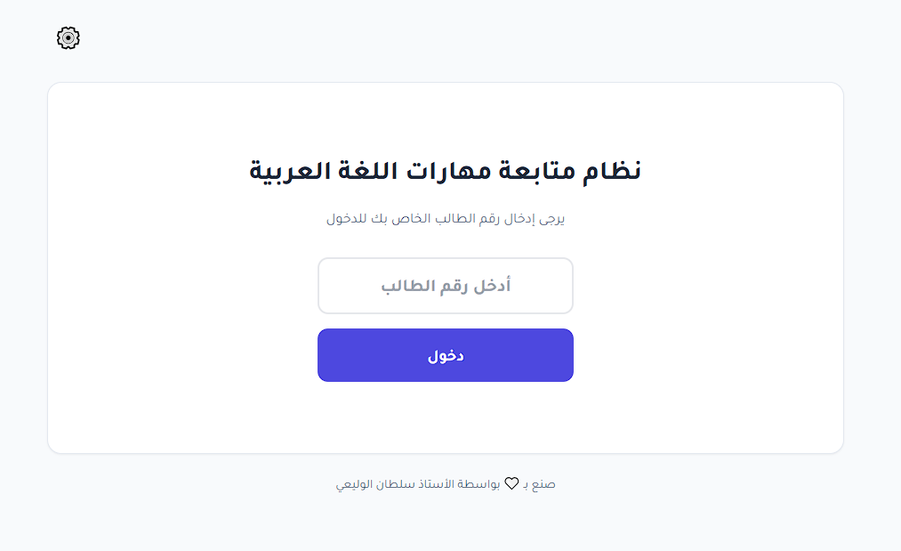
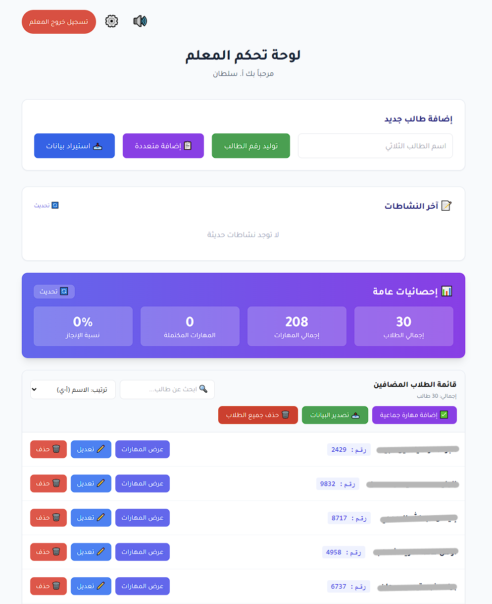
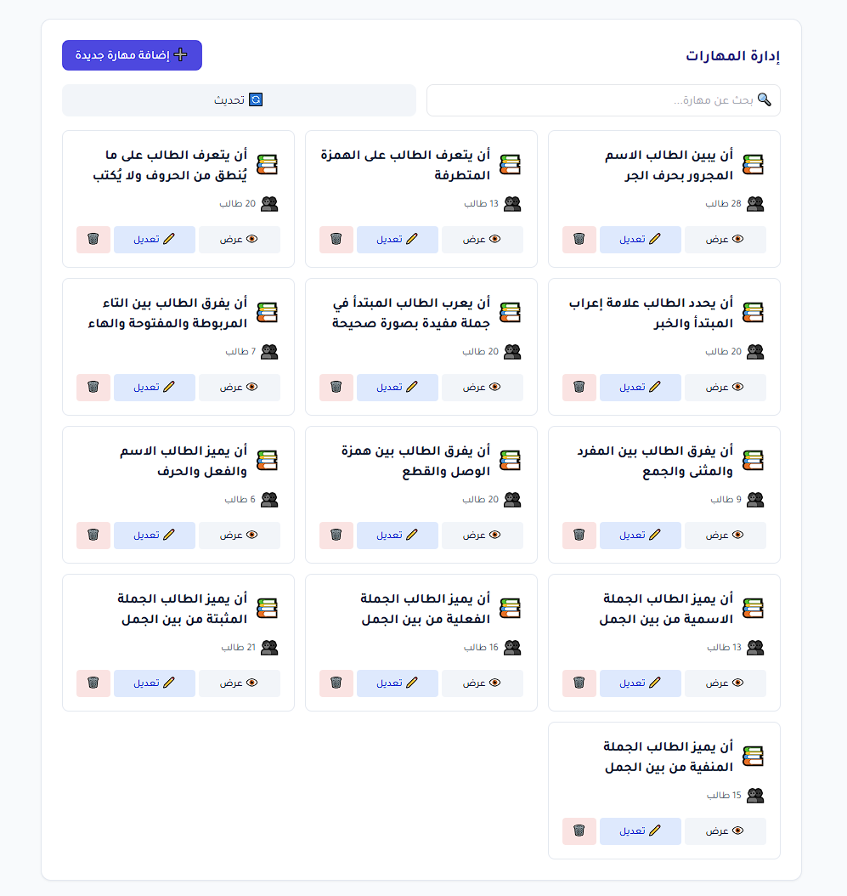
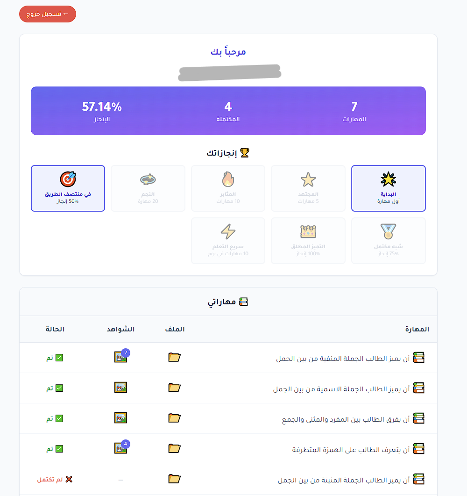

# نظام متابعة مهارات الطلاب 📚

منصة سهلة لمتابعة مهارات الطلاب في اللغة العربية، تساعد المعلمين على تتبع تقدم الطلاب على معرفة المهارات التي يحتاجون لتحسينها.

## معاينة التطبيق 📸

### الصفحة الرئيسية

### لوحة تحكم المعلم

### إدارة المهارات

### واجهة الطالب

---

## ما هو هذا النظام؟ 🎯

نظام بسيط يمكّن:
- **المعلمين** من إدارة بيانات الطلاب ومتابعة مهاراتهم بسهولة
- **الطلاب** من الاطلاع على مهاراتهم وما يحتاجون لتطويره

## المميزات الرئيسية ✨

- واجهة عربية سهلة الاستخدام
- دخول آمن للطلاب والمعلمين
- لوحة تحكم بسيطة للمعلم
- متابعة مستمرة لمهارات كل طالب
- إمكانية التصدير والنسخ الاحتياطي

## كيفية الاستخدام 📖

### للطلاب:
1. افتح الموقع
2. أدخل رقم الطالب الخاص بك
3. شاهد المهارات التي تحتاج إلى تحسينها

### للمعلمين:
1. اضغط على أيقونة الإعدادات ⚙️
2. أدخل كلمة المرور
3. أضف الطلاب ومهاراتهم
4. تابع تقدم كل طالب

## الأمان والخصوصية 🔐

- جميع البيانات محمية ومشفرة
- لا يتم مشاركة معلومات الطلاب مع أي جهة خارجية

---

صنع بـ 🤍 بواسطة الأستاذ سلطان الوليعي
